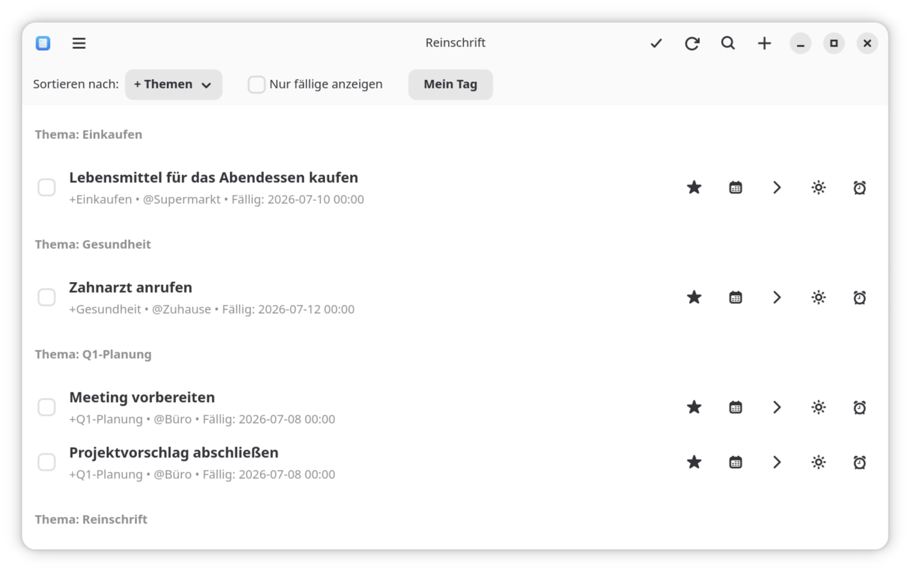

# Reinschrift

> 🇬🇧 [English version](README.md)

Verwalte deine Aufgaben in reinem Markdown — mit einer nativen GNOME-Desktop-App, einer CLI und einer Web-App.

Reinschrift kombiniert eine native GNOME-Oberfläche mit der Einfachheit von reinem Text. Deine Aufgaben bleiben eine ganz normale Markdown-Datei: leicht zu sichern, per Git versionierbar und auf jedem Gerät mit deinem Lieblingseditor editierbar. Die App synchronisiert die Datei über Nextcloud/WebDAV, liest Änderungen live ein und schreibt direkt zurück — klassische To-do-Listen im Klartext, alltagstauglich gemacht, ohne proprietäre Silos.



## Das Aufgabenformat

Jede Aufgabe ist eine Zeile Markdown:

```markdown
- [ ] Aufgabentitel +projekt @ort due:2026-01-20 rec:weekly ~note:"Weitere Details" ^ID123
- [x] Erledigte Aufgabe ✅ 2026-01-15
```

| Token | Bedeutung |
|---|---|
| `+projekt` | Projekt (Anführungszeichen erlaubt: `+"Großes Projekt"`) |
| `@ort` | Kontext / Ort |
| `due:YYYY-MM-DD` | Fälligkeitsdatum, optional mit Uhrzeit (`due:2026-01-20T14:00`) |
| `rec:weekly` | Wiederholung (wird beim Abschließen neu angelegt) |
| `~note:"…"` | Freitext-Notiz |
| `^ID123` | Stabile Referenz-ID |

## Funktionen

- **Plain Text zuerst** — eine Markdown-Datei, keine Datenbank, kein Lock-in
- **WebDAV/Nextcloud-Sync** — oder eine lokale Datei; externe Änderungen werden live erkannt
- **Mein Tag** — tägliche Aufgabenplanung: wähle aus, was du heute erledigen willst
- **Suche, Filter, Sortierung** — nach Projekt, Ort oder Fälligkeit
- **Wiederkehrende Aufgaben** — `rec:daily`, `rec:weekly`, `rec:monthly`, …
- **Spracheingabe** — lokale Transkription per Whisper (Desktop) bzw. Web Speech API (Web)
- **KI-Aufgabenerkennung** — natürliche Sprache wird per Ollama/LLM in strukturierte Aufgaben übersetzt (optional)
- **Sechs Sprachen** — Deutsch, Englisch, Spanisch, Französisch, Japanisch, Schwedisch

## Installation

### Desktop (Flatpak)

<a href="https://flathub.org/apps/me.dumke.Reinschrift"></a>

```bash
flatpak install flathub me.dumke.Reinschrift
```

### Web-App (Docker)

Bei jedem Release wird ein fertiges Image auf GHCR veröffentlicht — kein lokales Bauen nötig:

```bash
cd webapp
cp docker-compose.example.yml docker-compose.yml   # dann Zugangsdaten etc. anpassen
docker compose up -d                               # zieht ghcr.io/danst0/reinschrift-web:latest
```

Verfügbare Tags: `latest` sowie eines pro Version (z. B. `0.23.7`). Die App ist anschließend unter `http://localhost:5000` erreichbar. Login, OIDC und WebDAV werden über Umgebungsvariablen in `docker-compose.yml` konfiguriert (siehe Beispieldatei). Die Web-App lässt sich auf Mobilgeräten als PWA installieren.

### Aus den Quellen bauen

Voraussetzungen: Rust-Toolchain, GTK4- und libadwaita-Entwicklungsbibliotheken (`libgtk-4-dev`, `libadwaita-1-dev` o. ä.), `cmake` und `clang` (für die Whisper-Spracheingabe).

```bash
cargo build --workspace --release
# Binaries:
#   target/release/reinschrift_todo   (GUI)
#   target/release/reinschrift        (CLI)
```

## Komponenten

Dieses Repository ist ein Cargo-Workspace plus eine Python-Web-App:

| Verzeichnis | Inhalt |
|---|---|
| `core/` | Gemeinsame Rust-Bibliothek: Parsing, Rendering, Speicher (lokal + WebDAV), Geschäftslogik |
| `gui/` | Native GNOME-App (GTK4/libadwaita) |
| `cli/` | Kommandozeilen-Interface |
| `webapp/` | Flask-Web-App (Docker, OIDC-Login, PWA) |

### CLI

```
reinschrift [OPTIONEN] <BEFEHL>

OPTIONEN:
    -d, --database <PFAD>    Pfad zur Markdown-Datenbank
    -l, --language <SPRACHE> Sprache (de, en, es, fr, ja, sv)
    -j, --json               JSON-Ausgabe für Skripte
        --no-color           Farbausgabe deaktivieren

BEFEHLE:
    list (ls)       Aufgaben auflisten (mit Filter/Sortierung)
    add             Neue Aufgabe anlegen
    edit            Aufgabe bearbeiten
    delete (rm)     Aufgabe(n) löschen
    done            Als erledigt markieren
    undone          Als offen markieren
    today           Fälligkeit auf heute setzen
    tomorrow        Fälligkeit auf morgen setzen
    search          Aufgaben durchsuchen
    config          WebDAV- und KI-Konfiguration
```

Beispiele:

```bash
reinschrift add "Blumen gießen +zuhause @garten due:2026-06-05 rec:weekly"
reinschrift list --sort due
reinschrift done ^ID123
```

## Entwicklung

```bash
# GUI aus den Quellen starten
cargo run -p reinschrift-gui --release

# Eigene Datenbankdatei verwenden
TODOS_DB_PATH=/pfad/zur/db.md cargo run -p reinschrift-gui

# CLI starten
cargo run -p reinschrift-cli -- list
```

Git-Hooks aktivieren, damit vor jedem Commit automatisch `cargo check --locked --workspace` läuft (mit `SKIP_CARGO_CHECK=1` einmalig überspringbar):

```bash
git config core.hooksPath .githooks
```

### Tests

```bash
# Rust
cargo test --workspace

# Web-App
cd webapp
pip install -r requirements.txt -r requirements-dev.txt
pytest tests/ -v
mypy app/
```

## Lizenz

[GPL-3.0-or-later](LICENSE)
