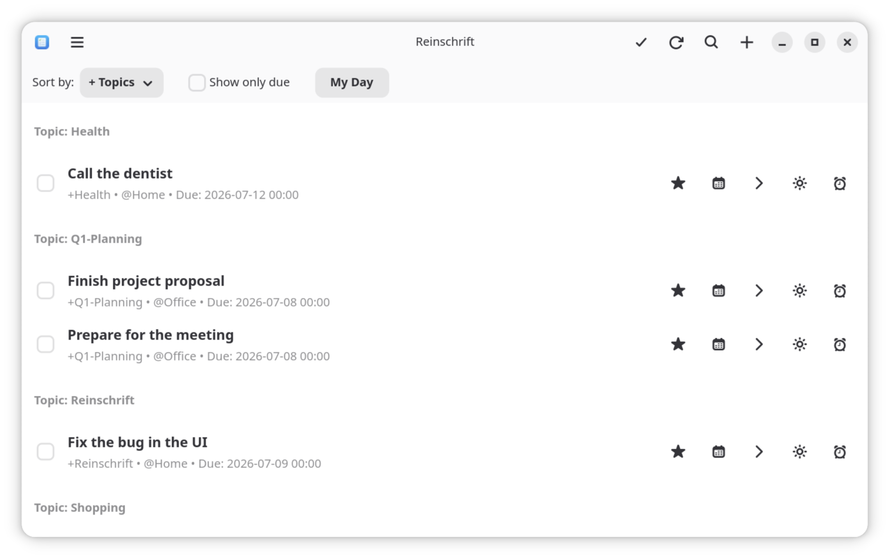

# Reinschrift

> 🇩🇪 [Deutsche Version](README.de.md)

Manage your todos in plain Markdown — with a native GNOME desktop app, a CLI, and a web app.

Reinschrift combines a native GNOME interface with the simplicity of plain text. Your tasks remain a normal Markdown file: easy to back up, versionable via Git, and editable on any device with your favorite editor. The app syncs the file via Nextcloud/WebDAV, reads changes live, and writes directly back — classic plain-text to-do lists, made suitable for everyday use, without proprietary silos.



## The todo format

Each task is one line of Markdown:

```markdown
- [ ] Task title +project @context due:2026-01-20 rec:weekly ~note:"Additional details" ^ID123
- [x] Completed task ✅ 2026-01-15
```

| Token | Meaning |
|---|---|
| `+project` | Project (quotes allowed: `+"Big Project"`) |
| `@context` | Context / location |
| `due:YYYY-MM-DD` | Due date, optionally with time (`due:2026-01-20T14:00`) |
| `rec:weekly` | Recurrence (recreated on completion) |
| `~note:"…"` | Free-form note |
| `^ID123` | Stable reference ID |

## Features

- **Plain text first** — one Markdown file, no database, no lock-in
- **WebDAV/Nextcloud sync** — or a plain local file; external changes are picked up live
- **My Day** — daily task planning: pick what you want to do today
- **Search, filtering, sorting** — by project, context, or due date
- **Recurring tasks** — `rec:daily`, `rec:weekly`, `rec:monthly`, …
- **Voice input** — local transcription via Whisper (desktop) or the Web Speech API (web)
- **AI task parsing** — turn natural language into structured tasks via Ollama/LLM (optional)
- **Six languages** — German, English, Spanish, French, Japanese, Swedish

## Installation

### Desktop (Flatpak)

<a href="https://flathub.org/apps/me.dumke.Reinschrift"></a>

```bash
flatpak install flathub me.dumke.Reinschrift
```

### Web app (Docker)

```bash
cd webapp
cp docker-compose.example.yml docker-compose.yml   # then adjust credentials etc.
docker compose up --build
```

The app is then available at `http://localhost:5000`. Login, OIDC, and WebDAV are configured via environment variables in `docker-compose.yml` (see the example file). The web app is installable as a PWA on mobile.

### Build from source

Requirements: Rust toolchain, GTK4 and libadwaita development libraries (`libgtk-4-dev`, `libadwaita-1-dev` or similar), `cmake` and `clang` (for Whisper voice input).

```bash
cargo build --workspace --release
# Binaries:
#   target/release/reinschrift_todo   (GUI)
#   target/release/reinschrift        (CLI)
```

## Components

This repository is a Cargo workspace plus a Python web app:

| Directory | What it is |
|---|---|
| `core/` | Shared Rust library: parsing, rendering, storage (local + WebDAV), business logic |
| `gui/` | Native GNOME app (GTK4/libadwaita) |
| `cli/` | Command-line interface |
| `webapp/` | Flask web app (Docker, OIDC login, PWA) |

### CLI

```
reinschrift [OPTIONS] <COMMAND>

OPTIONS:
    -d, --database <PATH>    Path to the Markdown database
    -l, --language <LANG>    Language (de, en, es, fr, ja, sv)
    -j, --json               JSON output for scripting
        --no-color           Disable colored output

COMMANDS:
    list (ls)       List todos with filtering/sorting
    add             Add a new todo
    edit            Edit an existing todo
    delete (rm)     Delete todo(s)
    done            Mark as completed
    undone          Mark as incomplete
    today           Set due date to today
    tomorrow        Set due date to tomorrow
    search          Search todos
    config          WebDAV and AI configuration
```

Examples:

```bash
reinschrift add "Water the plants +home @garden due:2026-06-05 rec:weekly"
reinschrift list --sort due
reinschrift done ^ID123
```

## Development

```bash
# Run the GUI from source
cargo run -p reinschrift-gui --release

# Use a custom database file
TODOS_DB_PATH=/path/to/db.md cargo run -p reinschrift-gui

# Run the CLI
cargo run -p reinschrift-cli -- list
```

Enable the Git hooks so `cargo check --locked --workspace` runs before every commit (set `SKIP_CARGO_CHECK=1` to skip once):

```bash
git config core.hooksPath .githooks
```

### Tests

```bash
# Rust
cargo test --workspace

# Web app
cd webapp
pip install -r requirements.txt -r requirements-dev.txt
pytest tests/ -v
mypy app/
```

## License

[CC BY-SA 4.0](LICENSE)
